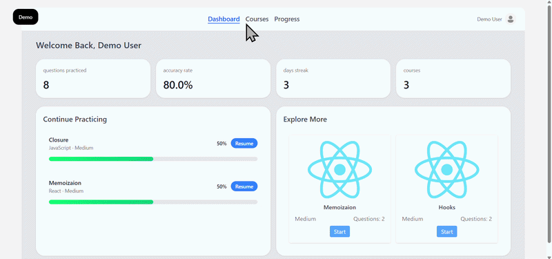

# Interview Practice
<p align="center">
  
  
</p>

<p align="center">
  
</p>


A React project built to explore and practice both frontend and backend, mostly frontend, with the concept of a platforn for practicing questions for interview.

## Demo

Live demo: [https://interview-practice-demo-iota.vercel.app/](https://interview-practice-demo-iota.vercel.app/)

> The demo runs in **mock mode** — no backend required. All data is simulated locally in your browser.

---

## About

Interview Practice is a full-stack web application designed to simulate technical interview experiences and help users improve their problem-solving skills.

The project focuses on building a realistic interview workflow, including question management, practice sessions, and performance tracking. It serves as a practical environment for exploring modern frontend and backend development patterns while providing an interactive learning experience for users.

The frontend is built with React, TypeScript, Tailwind CSS, and Vite, while the backend is powered by Django. The application is currently under active development, with additional features, deployment support, and production-ready improvements planned for future releases.

---

## Tech Stack

* React, (TS)
* tailwind
* Vite
* Django (planned)

---

## Requirements

Before running the project locally, ensure the following tools are installed:

### Frontend

* Node.js 18 or later
* npm (included with Node.js)

### Backend

* Python 3.11 or later
* pip
* Virtual environment support (`venv`)

Verify your installation:

```bash
node -v
npm -v
python --version
pip --version
```

---

## Installation

### 1. Clone the repository

```bash
git clone https://github.com/NiushaEbrahimi/interview-practice.git
cd interview-practice
```

### 2. Start the frontend

```bash
cd frontend

npm install

npm run dev
```

The frontend development server will start on the configured Vite port.

### 3. Start the backend

Open a new terminal:

```bash
cd backend

python -m venv venv
```

Activate the virtual environment:

**Windows**

```bash
venv\Scripts\activate
```

**macOS / Linux**

```bash
source venv/bin/activate
```

Install dependencies:

```bash
pip install -r requirements.txt
```

Apply migrations:

```bash
python manage.py migrate
```

Start the Django development server:

```bash
python manage.py runserver
```

The backend API will be available on the configured Django development port.

### Demo Mode

When the backend is not available (e.g. on Vercel), the frontend automatically activates **demo mode** with simulated data. No configuration needed — just deploy the `frontend/` directory to Vercel:

1. Connect your GitHub repo to Vercel
2. Set the **Root Directory** to `frontend`
3. Framework: Vite (auto-detected)
4. Deploy

The app will show a "Demo Mode" banner and all features will work with mock data.

---

## Roadmap

* [x] mock data for vercel and preview
* [x] deployment
* [x] improving responsive
* [ ] adding AI SDK for checking the users answer and calculating the correctness

---

## License

This project is intended for learning and experimentation.
