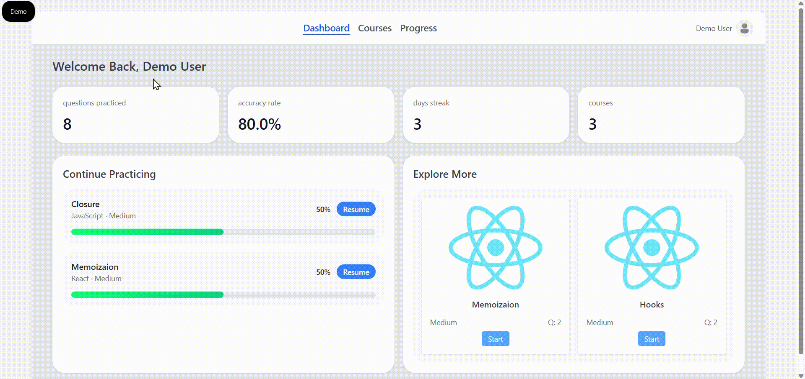

# Interview Practice

<p align="center">
  
  
</p>

<p align="center">
  
</p>

A full-stack web app for practicing technical interview questions with AI-powered scoring and feedback.

## Demo

Live demo: [https://interview-practice-demo-iota.vercel.app/](https://interview-practice-demo-iota.vercel.app/)

> The demo runs in **mock mode** — no backend required. All data is simulated locally in your browser.

---

## About

Interview Practice is a full-stack web application designed to simulate technical interview experiences and help users improve their problem-solving skills.

The frontend is built with React, TypeScript, Tailwind CSS, and Vite. The backend is powered by Django REST Framework with JWT authentication. The AI scoring feature uses Ollama for local LLM inference, or any OpenAI-compatible API provider.

---

## Tech Stack

### Frontend
* React 19 + TypeScript
* Tailwind CSS 4
* Vite 7
* React Router 7
* AI SDK UI (`@ai-sdk/react`) for chat-based AI scoring

### Backend
* Django + Django REST Framework
* JWT authentication (`djangorestframework-simplejwt`)
* CORS support (`django-cors-headers`)
* OpenAI-compatible LLM API (Ollama, OpenAI, or any compatible provider)

---

## Requirements

### Frontend

* Node.js 18 or later
* npm (included with Node.js)

### Backend

* Python 3.11 or later
* pip
* Virtual environment support (`venv`)
* One of the following for AI scoring:
  * **Ollama** (free, local) — recommended
  * OpenAI API key
  * Any OpenAI-compatible provider

Verify your installation:

```bash
node -v
npm -v
python --version
pip --version
```

---

## Installation

### 1. Clone the repository

```bash
git clone https://github.com/NiushaEbrahimi/interview-practice.git
cd interview-practice
```

### 2. Start the frontend

```bash
cd frontend
npm install
npm run dev
```

The frontend dev server starts on `http://localhost:5173`.

### 3. Start the backend

Open a new terminal:

```bash
cd backend
python -m venv venv
```

Activate the virtual environment:

**Windows**
```bash
venv\Scripts\activate
```

**macOS / Linux**
```bash
source venv/bin/activate
```

Install dependencies:

```bash
pip install django djangorestframework djangorestframework-simplejwt django-cors-headers python-dotenv openai
```

Apply migrations:

```bash
python manage.py migrate
```

Start the Django dev server:

```bash
python manage.py runserver
```

The backend API will be available on `http://127.0.0.1:8000`.

### 4. Set up AI scoring

The AI scoring feature requires an LLM provider. You have two options:

#### Option A: Ollama (free, local)

1. Install Ollama from https://ollama.com/download
2. Pull a model:
   ```bash
   ollama pull gemma2:2b
   ```
   This downloads a ~1.7GB model. Other models work too — just update `LLM_MODEL` in `backend/.env`.

3. Make sure Ollama is running:
   ```bash
   ollama serve
   ```
   On Windows, Ollama usually starts automatically in the background.

#### Option B: Your own API key

If you have an OpenAI key or use another OpenAI-compatible provider (Groq, Together AI, etc.), edit `backend/.env`:

```env
# OpenAI
LLM_BASE_URL=https://api.openai.com/v1
LLM_API_KEY=sk-your-key-here
LLM_MODEL=gpt-4o-mini

# Or any OpenAI-compatible provider
# LLM_BASE_URL=https://api.groq.com/openai/v1
# LLM_API_KEY=gsk_your-key-here
# LLM_MODEL=llama-3.1-8b-instant
```

The default configuration uses Ollama — if you leave `backend/.env` as-is, it will connect to `localhost:11434`.

### 5. Seed the database with questions

The app comes with 220+ interview questions across 7 courses. Seed them with:

```bash
cd backend
python manage.py seed_from_json
```

Available courses and question counts:

| Course | Lessons | Questions |
|--------|---------|-----------|
| React | 4 | 40 |
| JavaScript | 4 | 40 |
| HTML & CSS | 5 | 50 |
| Python | 2 | 20 |
| Django | 3 | 30 |
| Next.js | 2 | 20 |
| TypeScript | 2 | 20 |

Useful flags:

```bash
python manage.py seed_from_json --list             # show available JSON files
python manage.py seed_from_json --course React      # seed only one course
python manage.py seed_from_json --incremental       # skip existing questions
```

#### Adding your own questions

Edit or create JSON files in `backend/api/seed_data/`. No Python knowledge needed:

```json
{
  "course": "Go",
  "description": "Go programming language",
  "lessons": [
    {
      "name": "Go Introduction",
      "level": 1,
      "questions": [
        {
          "question": "What is Go?",
          "correct_answer": "A statically typed, compiled language designed for simplicity and performance."
        },
        {
          "question": "What is a goroutine?",
          "correct_answer": "A lightweight thread managed by the Go runtime for concurrent execution."
        }
      ]
    }
  ]
}
```

Then seed it:

```bash
python manage.py seed_from_json --course Go
```

#### Generating questions with AI

If you have Ollama running, you can generate questions for any topic:

```bash
# Generate 10 questions for an existing lesson
python manage.py generate_questions --lesson "React Hooks" --count 10

# Preview without saving
python manage.py generate_questions --lesson "CSS Grid" --count 5 --dry-run

# Export to JSON for review before seeding
python manage.py generate_questions --lesson "Django REST" --count 8 --export rest_questions.json

# Generate only hard questions
python manage.py generate_questions --lesson "Python Decorators" --count 10 --difficulty hard
```

The lesson must already exist in the database. Generate questions, review them, then add the good ones to a JSON file for permanent storage.

---

## Demo Mode

When the backend is not available (e.g. on Vercel), the frontend automatically activates **demo mode** with simulated data including mock AI responses. 

The app will show a "Demo Mode" banner and all features will work with mock data.

---

## Features

* **Course & lesson browsing** — browse courses, lessons, and questions
* **Self-assessment** — rate your confidence on each question (1-5) and mark for review
* **AI scoring** — type your answer and get AI-powered feedback, scoring (1-5), and a suggested better answer
* **Progress tracking** — track which questions you've answered and your confidence over time
* **Stats dashboard** — view your overall performance and weak areas
* **Dark/light theme** — toggle manually or follow system preference
* **Question seeding** — 220+ questions across 7 courses, easily expandable via JSON files
* **AI question generation** — generate questions for any topic using Ollama
* **Demo mode** — full app works without a backend using mock data (including AI responses)
* **Responsive** — works on mobile, tablet, and desktop

---

## Roadmap

* [x] mock data for vercel and preview
* [x] deployment
* [x] responsive design
* [x] AI-powered answer scoring with Ollama / OpenAI-compatible providers
* [x] configurable LLM provider via environment variables
* [x] JSON-based question seeding system (220+ questions across 7 courses)
* [x] AI question generation via Ollama
* [x] dark/light theme with system preference detection
* [ ] improving prompt quality for better AI feedback
* [ ] adding more question categories
* [ ] user auth improvements (password reset, email verification)

---

## License

This project is intended for learning and experimentation.
